  

# 🛡️ Awesome Security Audit Logging: Ecosystem Guide & Compliance Solutions

  
  
  
  

> 🔍 A curated directory of **SaaS audit trail products** and **open-source security logging platforms** for IT compliance, SIEM threat detection, cloud forensics, and immutable audit log aggregation.

**🗓️ Last updated: October 2026**

---

## 📌 Table of Contents

- [📈 Market Size & Dynamics](#-market-size--dynamics)
- [☁️ SaaS / Hosted Audit Logging Platforms](#%EF%B8%8F-saas--hosted-audit-logging-platforms)
- [🔓 Open-Source Security & Audit Logging Repositories](#-open-source-security--audit-logging-repositories)
- [⚖️ Compliance & Retention Guidelines](#%EF%B8%8F-compliance--retention-guidelines)
- [🤝 How to Contribute](#-how-to-contribute)
- [💖 Support & Community](#-support--community)
- [⭐ Star History](#-star-history)
- [⚠️ Disclaimer](#%EF%B8%8F-disclaimer)

---

## 📈 Market Size & Dynamics

The global **Log Management and Security Audit Logging** market is estimated at **$4.35 Billion in 2026** (growing at a 12.5% CAGR toward $8+ Billion by 2030), while the broader **Security Analytics / SIEM** market exceeds **$19.6 Billion**. 

The sector is **moderately fragmented**: enterprise platform monoliths (Salesforce, Cisco Splunk, Datadog) capture high-volume corporate contracts, while specialized SaaS providers and a vibrant open-source ecosystem (Elastic, Grafana, Wazuh, Vector) address self-hosted sovereignty, cloud-native telemetry, and mid-market compliance logging.

---

## ☁️ SaaS / Hosted Audit Logging Platforms

Below is a comparison of commercial SaaS security audit trail platforms, sorted in **descending order by company valuation/market capitalization**.

| SaaS Platform | Company Valuation / Revenue | Starting Price Tier | Free Tier / Free Trial Limit | Core Audit & Security Logging Focus |
| :--- | :--- | :--- | :--- | :--- |
| **[Salesforce Audit Trail](https://help.salesforce.com/)** | **~$223 Billion** Market Cap (~$41.5B Rev) | Included in Enterprise ($165/user/mo) | 30-Day Developer Edition Free Org | Tracks setup changes, user logins, API events & data access within Salesforce environments. |
| **[Datadog Cloud SIEM](https://www.datadoghq.com/)** | **~$98 Billion** Market Cap (~$3.4B Rev) | $0.20 per GB ingested / month ($15/host/mo base) | 14-Day Free Trial (Full feature access, no credit card required) | Cloud-native security signals, log management, automated threat detection & audit compliance. |
| **[Splunk Cloud](https://www.splunk.com/)** *(Cisco)* | **$28 Billion** Acquisition (~$4.0B ARR) | ~$0.18 per GB ingested (Est. $150/mo minimum) | 14-Day Free Trial (up to 5GB/day ingestion) | Enterprise SIEM standard for deep security correlation, forensics & comprehensive audit search. |
| **[LogRhythm](https://logrhythm.com/)** *(Exabeam)* | **~$2.5 Billion** Combined Valuation (~$300M Rev) | Starts at ~$500/month (node/volume based) | 30-Day Guided Enterprise Free Trial | SIEM platform featuring native security log management, UEBA analytics & SOAR automation. |
| **[Sumo Logic](https://www.sumologic.com/)** | **$1.7 Billion** Private Valuation (~$300M Rev) | $3.00 per GB ingested (Essentials Plan) | Free Tier (up to 1GB/day ingestion, 7-day retention free forever) | Cloud-native log management, automated compliance reporting & real-time security analytics. |
| **[LogDNA (Mezmo)](https://www.mezmo.com/)** | **$370 Million** Valuation (~$34M Rev) | $1.25 per GB ingested / month | 14-Day Free Trial (reverts to limited community edition) | Telemetry data pipeline & log routing to control, enrich, and secure audit events. |
| **[Logz.io](https://logz.io/)** | **~$278 Million** Est. Valuation (~$48M Rev) | $0.92 per GB ingested / month | 14-Day Free Trial (Full platform access) | Cloud observability & log management built on OpenSearch with AI threat detection. |
| **[Papertrail](https://www.papertrail.com/)** *(SolarWinds)* | **SolarWinds $1.8B** Parent Market Cap | $7.00 per month (1 GB data, 4 weeks search) | Free Tier (50 MB/month free forever + 48h search) | Instant real-time log aggregation, live tailing & search alerts for small teams & dev ops. |

---

## 🔓 Open-Source Security & Audit Logging Repositories

The top open-source projects for capturing, routing, and analyzing security audit logs, sorted in **descending order by GitHub star counts**.

### 1. **[elastic/elasticsearch](https://github.com/elastic/elasticsearch)** 
- 📝 **Description**: The industry-standard distributed search and analytics engine powering log aggregation, Elastic Security, and custom SIEM audit trails.
- 📜 **License**: ELv2 / SSPL

### 2. **[grafana/grafana](https://github.com/grafana/grafana)** 
- 📝 **Description**: Multi-platform visualization and analytics dashboard used to build interactive SOC panels, compliance metrics, and log queries.
- 📜 **License**: AGPL-3.0

### 3. **[grafana/loki](https://github.com/grafana/loki)** 
- 📝 **Description**: Horizontally scalable, highly available multi-tenant log aggregation system designed to index metadata rather than full-text log contents.
- 📜 **License**: AGPL-3.0

### 4. **[vectordotdev/vector](https://github.com/vectordotdev/vector)** 
- 📝 **Description**: High-performance, Rust-based observability data pipeline for collecting, transforming, and routing massive log and audit event streams.
- 📜 **License**: MPL-2.0

### 5. **[wazuh/wazuh](https://github.com/wazuh/wazuh)** 
- 📝 **Description**: Complete enterprise open-source security monitoring platform featuring native audit log analysis, FIM, vulnerability detection & regulatory compliance dashboards (PCI DSS, HIPAA, GDPR).
- 📜 **License**: GPL-2.0

### 6. **[opensearch-project/OpenSearch](https://github.com/opensearch-project/OpenSearch)** 
- 📝 **Description**: Community-driven, open-source search and analytics suite featuring Security Analytics with pre-built Sigma rules and anomaly detection.
- 📜 **License**: Apache-2.0

### 7. **[fluent/fluentd](https://github.com/fluent/fluentd)** 
- 📝 **Description**: CNCF-graduated unified logging layer with 500+ plugins for filtering, parsing, and shipping audit logs across enterprise infrastructures.
- 📜 **License**: Apache-2.0

### 8. **[fluent/fluent-bit](https://github.com/fluent/fluent-bit)** 
- 📝 **Description**: Super fast, lightweight log processor and forwarder built for Kubernetes environments, microservices, and edge devices.
- 📜 **License**: Apache-2.0

### 9. **[Graylog2/graylog2-server](https://github.com/Graylog2/graylog2-server)** 
- 📝 **Description**: Centralized log management engine with real-time search, alert routing, dashboards, and experimental Model Context Protocol (MCP) endpoint integration.
- 📜 **License**: SSPL-1.0

### 10. **[open-telemetry/opentelemetry-collector](https://github.com/open-telemetry/opentelemetry-collector)** 
- 📝 **Description**: Vendor-agnostic proxy receiver, processor, and exporter for vendor-neutral telemetry logs, metrics, and traces.
- 📜 **License**: Apache-2.0

### 11. **[arkime/arkime](https://github.com/arkime/arkime)** 
- 📝 **Description**: Large-scale, open-source PCAP network log capture, indexing, and deep packet audit inspection interface.
- 📜 **License**: Apache-2.0

### 12. **[OISF/suricata](https://github.com/OISF/suricata)** 
- 📝 **Description**: High-performance Network Threat Detection, IDS/IPS, and Network Security Monitoring engine outputting structured JSON audit logs.
- 📜 **License**: GPL-2.0

### 13. **[ossec/ossec-hids](https://github.com/ossec/ossec-hids)** 
- 📝 **Description**: Classic host-based intrusion detection system (HIDS) performing rootkit detection, log analysis, and system integrity checking.
- 📜 **License**: GPL-2.0

### 14. **[syslog-ng/syslog-ng](https://github.com/syslog-ng/syslog-ng)** 
- 📝 **Description**: High-performance system log management tool featuring structured JSON parsing, TLS encryption, and automated archiving.
- 📜 **License**: GPL-2.0 / LGPL-2.1

### 15. **[d3vhex/Sentora](https://github.com/d3vhex/Sentora)** 
- 📝 **Description**: Open-source, AI-powered self-hosted SIEM, EDR, and SOAR platform with air-gapped threat intelligence feed integration.
- 📜 **License**: GPL-3.0

### 16. **[Security Shallots (PyPI)](https://pypi.org/project/security-shallots/)**
- 📝 **Description**: Hardware-adaptive lightweight self-hosted SIEM engine designed to run log correlation on resource-constrained devices (Raspberry Pi to Servers).

### 17. **[CNSL (PyPI)](https://pypi.org/project/cnsl/)**
- 📝 **Description**: Correlated Network Security Layer offering auth monitoring, ML anomaly detection, and automated PDF compliance audit reports.

---

## ⚖️ Compliance & Retention Guidelines

When configuring security audit trails for regulatory compliance, ensure your log storage retention meets statutory minimums:

- 💳 **PCI DSS 4.0**: Minimum 1 year audit trail retention (3 months immediately available online).
- 🏥 **HIPAA**: Minimum 6 years retention for audit logs & security access records.
- 📊 **SOX (Sarbanes-Oxley)**: Minimum 7 years retention for financial audit logs & access history.
- 🔐 **GDPR / NIS2**: Mandates continuous log monitoring, immutability, and rapid breach notification capability.

---

## 🤝 How to Contribute

1. 🍴 Fork this repository.
2. ✏️ Add or update entries in `README.md` following the table or list schema.
3. 🔗 Ensure all links point to authoritative platform documentation or GitHub repositories.
4. 🚀 Submit a Pull Request with a clear description of the addition.

---

## 💖 Support & Community

Thank you for exploring and using this security audit logging resource! If you find this repository helpful, please consider showing your support:

- ⭐ **Star** this repository on GitHub to help others discover it.
- 🔀 **Fork** and contribute new security tools or SaaS updates.
- 📢 **Share** it with fellow security engineers, CISOs, and DevSecOps practitioners.
- ☕ **Sponsor / Buy Me a Coffee**: Support ongoing open-source maintenance via the [GitHub Sponsor Dashboard](https://github.com/sponsors/ishandutta2007).

---

## ⭐ Star History

---

## ⚠️ Disclaimer

- This directory is a **community-curated guide** intended for informational purposes.
- Security audit logs process sensitive telemetry and potential PII; self-hosted installations must be properly hardened.
- Open-source implementations require administrative management for storage scaling, index lifecycle management, and compliance enforcement.

---

  <b>Built with ❤️ for Security Engineers, DevSecOps Teams, and CISOs.</b>

